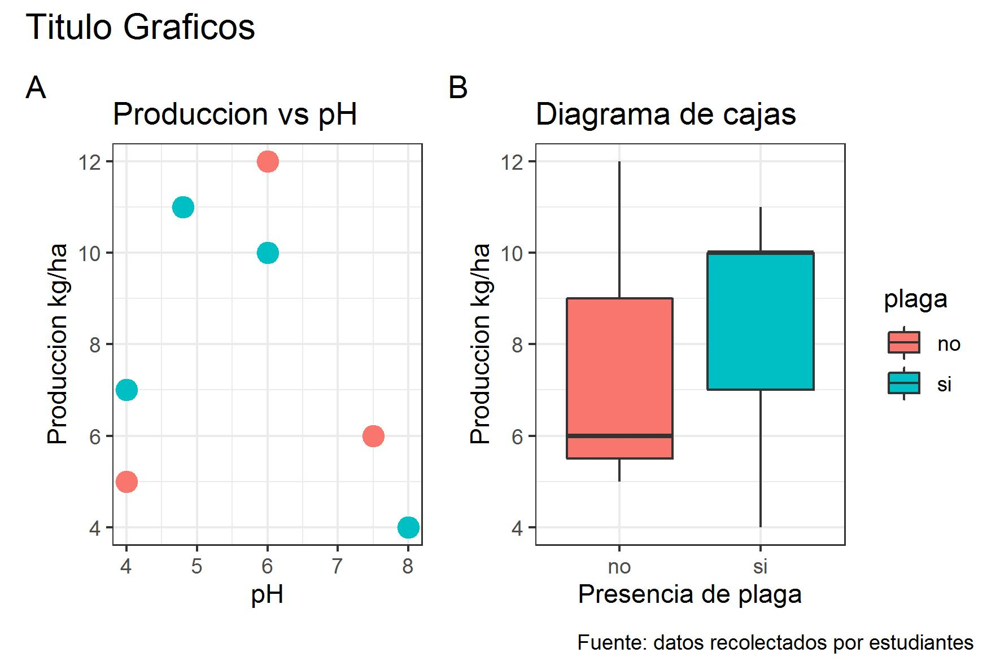

# Introducción

Este es un informe de la salida de campo con los estudiantes de la UNIPAMPLONA en el uso de herramientas libres y en la recolecta y automatización de analisis de datos.

# Materiales y metodos

## Area de estudio

```{r, echo=FALSE,message=FALSE, out.width="80%"}
knitr::include_graphics("Mapa.jpg")
```

## Metodos

Se diseño un formulario usando los software libres ODKcollect, los cuales eran enviados a google drive, estos a su vez era obtenidos con @rcore y analizados.

# Resultados

```{r, echo=FALSE}

```

# Conclusión

Es muy práctico usar Rmarkdown

# Bibliografía  
