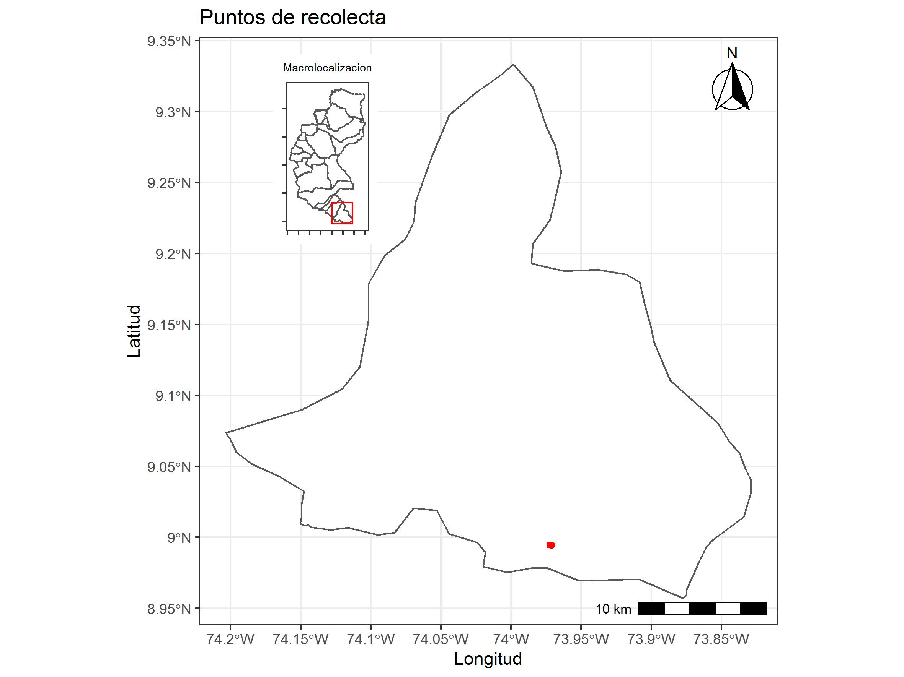

```{r, include=FALSE}
library(tidyverse)
library(xtable)

# Leer los datos en R
datos <- readxl::read_xlsx("Datos.xlsx")

# Renombrando las variables
names(datos) <- sub("data-", "", names(datos))

# Arreglando las variables
datos <- datos %>% separate("localizacion", c("latitud", "longitud"), sep = ",")
```


# Introducción  

Este es un informe de la salida de campo con los estudiantes de la UNIPAMPLONA en el uso de herramientas libres y en la recolecta y automatización de analisis de datos.

# Materiales y metodos

## Area de estudio

```{r, echo=FALSE,message=FALSE, out.width="80%"}

```

## Metodos  

Se diseño un formulario usando los software libres ODKcollect, los cuales eran enviados a google drive, estos a su vez era obtenidos con @rcore y analizados.

# Resultados  


```{r,echo=FALSE}
tabla <- datos %>% dplyr::select(fecha, latitud, longitud, pH, produccion)

flextable::flextable(tabla, cwidth = 1)
```


```{r, echo=FALSE}

```

# Conclusión  

Es muy práctico usar Rmarkdown

# Bibliografía  

